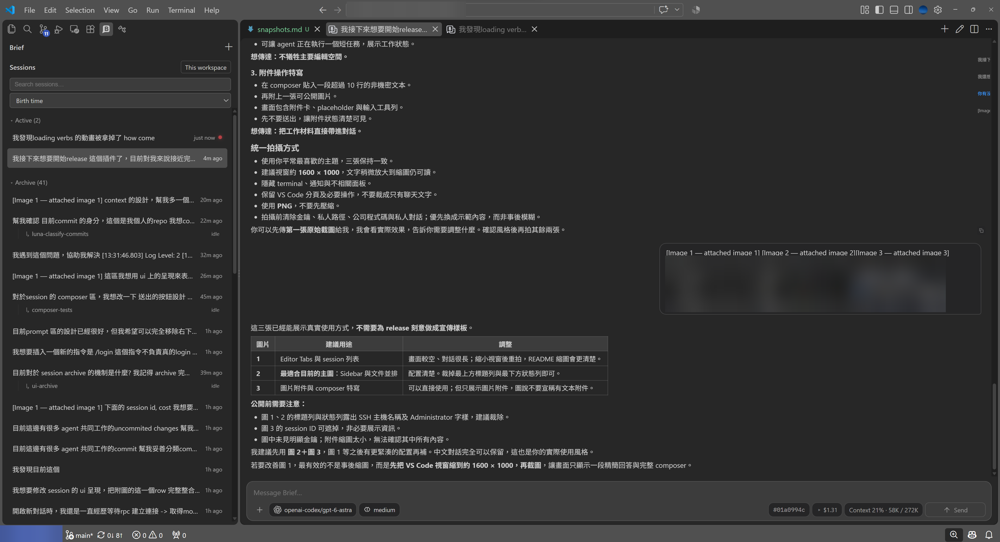
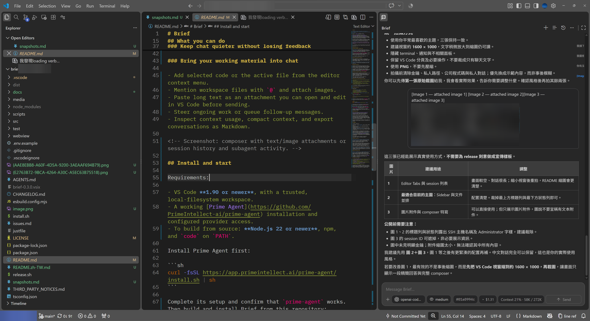

# Brief

**A personal take on Prime Agent in VS Code. One workspace, parallel sessions, and chat that fits the way you code.**

English | [繁體中文](README.zh-TW.md)

Brief is an independent fork of [sirouk/prime-agent-vscode](https://github.com/sirouk/prime-agent-vscode), powered by [Prime Agent](https://github.com/PrimeIntellect-ai/prime-agent). It is built around my daily workflow and preferences—not an attempt to define the right interface for everyone.

The current release is ready for my everyday use. Some UI edges remain, and improvements follow real use rather than a promise of a perfectly polished experience.

> **Community project.** Brief is not published by, endorsed by, or affiliated with Prime Intellect. Prime Agent provides the runtime; Brief provides the VS Code interface.



*Editor Tabs: browse and sort sessions, keep conversations alongside file tabs, and follow activity and the conversation outline.*

## What you can do

### Choose Sidebar or Editor Tabs

Use **Sidebar** to keep the editor area for code, or **Editor Tabs** to give each conversation its own native VS Code tab. Drag tabs into separate editor groups to work beside code or compare conversations.

Run `Brief: Use Sidebar` or `Brief: Use Editor` to move the current session and remember the workspace preference. New sessions open in Editor Tabs by default. Moving a session does not stop its agent.



*Sidebar: Explorer, your file, and chat in one window. This example places Brief in the Secondary Side Bar.*

### Work with parallel sessions

Start independent conversations for implementation, investigation, review, or tests in one workspace. Browse session history, rename or archive conversations, and follow subagent activity.

**Sessions share workspace files; they are not isolated checkouts.** Coordinate edits when agents work on the same files.

### Leave and return

Closing a tab closes the view, not the work. Brief's sessions run in the Prime Agent daemon and can continue when you reload or close VS Code. Reopen the workspace and return through restored tabs or session history.

This depends on the daemon and its host remaining available. It does not keep work running through machine shutdown, sleep, or runtime termination. To cancel a run, use the stop button or `Brief: Stop Agent`.

### Keep chat quieter without losing feedback

Working indicators, elapsed time, session activity, and completion notifications make progress visible. Thinking, tool-output streaming, and usage details are separately configurable. Colors follow your VS Code theme, including High Contrast.

These changes improve interface feedback and rendering—not model generation speed.

### Bring your working material into chat

- Add selected code or the active file from the editor context menu.
- Mention workspace files with `@` and attach images.
- Paste long text as an attachment you can open and edit in VS Code before sending.
- Steer ongoing work or queue follow-up messages.
- Inspect context usage, compact context, and export conversations as Markdown.

## Install and start

Requirements:

- VS Code **1.90 or newer**, with a trusted, local-filesystem workspace.
- A working [Prime Agent](https://github.com/PrimeIntellect-ai/prime-agent) installation. Provider access can be configured with `/login` in Brief.

Install Prime Agent first:

```sh
curl -fsSL https://app.primeintellect.ai/prime-agent/install.sh | sh
```

Complete its setup and confirm that `prime-agent` works. Then install Brief through VS Code:

1. Open [GitHub Releases](https://github.com/litechenacc/brief/releases) and download the release's `.vsix` asset (`brief-<version>.vsix`). Do not download the source-code archive for installation.
2. In VS Code, open **Extensions**, select **… → Install from VSIX…**, and choose the downloaded file. You can also run **Extensions: Install from VSIX...** from the Command Palette.
3. Reload VS Code if prompted, open a trusted workspace, and run **Brief: New Session**.

Enter `/login` in Brief to select a provider and complete OAuth or enter an API key through VS Code. Providers come from the installed Prime Agent SDK; browser authorization still opens externally. Prime manages credential storage, shared with `prime-agent` on the same host and configuration directory. With Remote SSH, the SDK runs on the remote extension host. MCP Connections and special setup flows are identified as unsupported rather than sent as chat prompts.

To update, download the newer release's VSIX and repeat the installation. If VS Code cannot find the runtime, set `brief.command` to the absolute path of `prime-agent`.

You do not need to clone this repository, install build tools, or run `just` to use a release. For source builds and customization, see [Development and forks](docs/usage.md#development-and-forks). For commands, settings, attachment behavior, and persistence limits, see the [usage guide](docs/usage.md).

## Why this fork?

Brief exists because [sirouk built and shared the original extension](https://github.com/sirouk/prime-agent-vscode). Thank you for providing the foundation that made this project possible.

This fork reflects my personal working habits and preferences for chat layout, parallel sessions, and interaction design. Some of those choices differ from the original extension's direction. Rather than propose every preference as an upstream pull request, I maintain them here as a separate project.

Different preferences do not make one version better for everyone. Use the original, use Brief, or make your own version.

## Roadmap

| Status | Direction |
| --- | --- |
| Available | Refined **Sidebar** chat for daily coding work. |
| Available | **Editor Tabs** with native tabs and parallel sessions. |
| Ongoing | Fix UI edges and interaction issues found during actual use. |
| Exploring | **Document Workspace**: Markdown-centered collaboration between people and agent sessions, beyond a linear chat. |

Document Workspace is a working name for the earlier “Session Area” idea. The direction is to let people and agents work around editable Markdown documents, with sessions attached to the work. It is **not available in this release**. See the [design discussion](https://chatgpt.com/share/6aa639e7-39f8-83e8-afd7-2641ced62b0f) for background; it is exploratory, not an implementation specification.

This roadmap describes interests, not delivery commitments. There is no promised schedule.

## Make it your own

**Fork freely. Use an AI agent to make Brief fit your own habits and style.** You do not need my permission, and your fork does not need to follow my design direction. Please retain the copyright and license notices required by the MIT license.

Issues and pull requests—including those made with AI agent assistance—are welcome. Please understand what you submit, explain its purpose, and include appropriate verification. You remain responsible for your submission, regardless of which tools helped create it.

This is a personal project maintained in my spare time. **Do not expect a timely response, review, or merge.** A response or merge is not guaranteed at all. If you need a change, you are welcome to move ahead in your own fork rather than wait for me.

## Use at your own risk

**Brief is provided “as is,” without warranty. Use it at your own risk.** It drives an agent runtime that can execute commands and change workspace files. Review agent actions and changes, protect credentials, and keep backups or version control for work you care about.

No support or maintenance is guaranteed. See [LICENSE](LICENSE) for the full warranty disclaimer and limitation of liability.

## Credits and license

- [sirouk/prime-agent-vscode](https://github.com/sirouk/prime-agent-vscode) — the original extension and foundation of this fork.
- [Prime Agent](https://github.com/PrimeIntellect-ai/prime-agent) — the agent runtime.
- [Lobe Icons](https://github.com/lobehub/lobe-icons) — provider icons; see [third-party notices](THIRD_PARTY_NOTICES.md).
- Lite Chen — Brief fork modifications.

Licensed under [MIT](LICENSE), retaining the original copyright notice and adding Lite Chen's notice for this fork's contributions. Prime Agent is a Prime Intellect trademark; this license grants no trademark rights.
